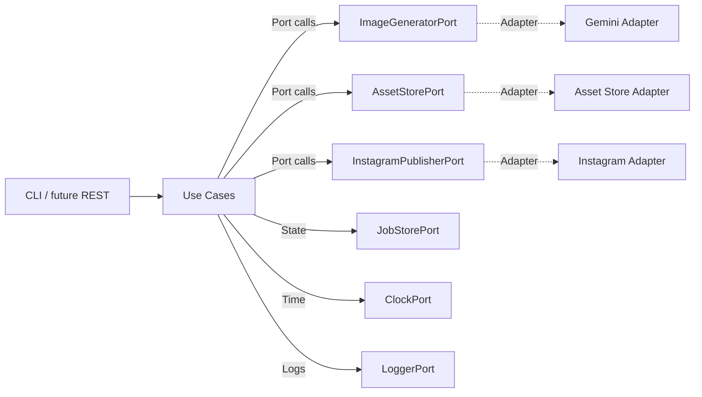
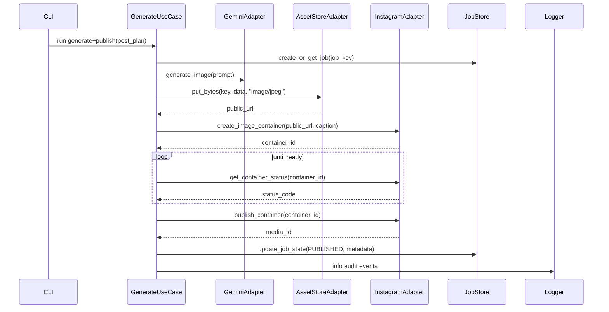

# Architecture Blueprint

## Goals
- Provide a clear, testable architecture for image generation and Instagram publishing.
- Separate business rules from infrastructure via hexagonal (ports and adapters) boundaries.
- Support scheduling, retries, and observability without coupling to specific vendors yet.

## Non-goals
- Implementing real API calls or storage providers (deferred to Step 3+).
- Selecting final infrastructure (storage, scheduler, databases) beyond proposed options.
- Adding full Python packaging, dependency management, or CI in this step.

## System context
- Inputs: prompts, captions, schedules provided via CLI (future REST compatible).
- Processing: use cases orchestrate generation, storage, and Instagram container + publish flow.
- Outputs: stored assets with public URLs, Instagram media posts, structured logs and audit events.
- External systems: Gemini image generation service, object storage that returns public URLs, Instagram Graph API, scheduler/queue.

## Primary flows
### Generate-only
1. CLI calls GenerateUseCase with `PromptSpec` and optional references.
2. Use case invokes `ImageGeneratorPort` to produce a `GeneratedImage`.
3. Use case optionally persists asset via `AssetStorePort` and records an `AuditEvent`.

### Publish-only
1. CLI provides an existing asset URL and caption.
2. Use case calls `InstagramPublisherPort.create_image_container` with asset URL.
3. Use case polls `get_container_status` until ready, then calls `publish_container`.
4. Job state transitions through CONTAINER_CREATED -> CONTAINER_READY -> PUBLISHED with audit logging.

### Generate + Publish
1. CLI triggers Generate+Publish use case with `PostPlan`.
2. Use case generates image, stores asset to obtain a public JPEG URL, and records state.
3. Creates Instagram container, polls status, publishes when ready, respecting rate limits.
4. Audit events capture prompt, asset store key/URL, container outcome, and publish result.

### Scheduled publish
1. Scheduler triggers use case at `PostPlan.scheduled_at` via `ClockPort` + `JobStorePort` lock.
2. Use case ensures idempotency via job key, proceeds with Generate+Publish flow, and retries on transient failures with backoff.

## Error handling strategy
- Transient errors: retry with exponential backoff and jitter (e.g., storage timeouts, 5xx from APIs).
- Terminal errors: mark job state as FAILED_TERMINAL and stop retries (e.g., invalid media, auth failures, exceeded rate limit window after max retries).
- All errors emit structured logs and `AuditEvent` entries with context.

## Idempotency strategy
- Each orchestrated action uses a `job_key` derived from prompt + caption + schedule (or external request id).
- `JobStorePort.create_or_get_job` returns existing state to prevent duplicate work.
- `lock_job`/`unlock_job` guard concurrent execution.
- Reuse existing container_id/media_id on retries when possible; avoid republishing a media_id already marked PUBLISHED.
- Publish step requires job state CONTAINER_READY to proceed, ensuring the flow cannot skip container polling.

## Security and secrets strategy
- Configuration provided via environment variables; no secrets stored in the repository.
- Future adapters should expect secrets (API keys, tokens) via env vars or secret manager bindings.
- Limit logged data to non-sensitive fields; redact tokens and access URLs as needed.

## Ports (interfaces)
Python protocol-like signatures describe the contracts between use cases and adapters.

```python
class ImageGeneratorPort(Protocol):
    def generate_image(self, prompt: PromptSpec, refs: list[ImageRef] | None = None) -> GeneratedImage: ...

class AssetStorePort(Protocol):
    def put_bytes(self, key: str, data: bytes, content_type: str) -> PublicUrl: ...
    def get_url(self, key: str) -> PublicUrl: ...

class InstagramPublisherPort(Protocol):
    def create_image_container(self, image_url: str, caption: str) -> ContainerId: ...
    def get_container_status(self, container_id: str) -> StatusCode: ...
    def publish_container(self, container_id: str) -> PublishedMediaId: ...
    def get_publishing_limit(self) -> PublishingLimit: ...

class JobStorePort(Protocol):
    def create_or_get_job(self, job_key: str) -> PublishJob: ...
    def update_job_state(self, job_id: str, state: JobState, metadata: dict[str, Any] | None = None) -> PublishJob: ...
    def lock_job(self, job_key: str) -> bool: ...
    def unlock_job(self, job_key: str) -> None: ...

class ClockPort(Protocol):
    def now(self) -> datetime: ...
    def sleep(self, seconds: float) -> None: ...

class LoggerPort(Protocol):
    def info(self, message: str, **fields: Any) -> None: ...
    def warning(self, message: str, **fields: Any) -> None: ...
    def error(self, message: str, **fields: Any) -> None: ...
```

## Core domain models

```python
@dataclass
class PromptSpec:
    text: str
    style_bible_ref: str | None
    aspect_ratio: str
    seed: int | None
    refs: list[ImageRef] | None

@dataclass
class GeneratedImage:
    data: bytes | None  # raw bytes when available in-process
    path: str | None    # optional local path reference
    mime: str
    width: int | None
    height: int | None
    sha256: str

@dataclass
class PostPlan:
    caption_template: str
    hashtags: list[str]
    scheduled_at: datetime | None
    prompt_spec: PromptSpec

class JobState(Enum):
    PLANNED = "PLANNED"
    GENERATED = "GENERATED"
    STORED = "STORED"
    CONTAINER_CREATED = "CONTAINER_CREATED"
    CONTAINER_READY = "CONTAINER_READY"
    PUBLISHED = "PUBLISHED"
    FAILED_RETRYABLE = "FAILED_RETRYABLE"
    FAILED_TERMINAL = "FAILED_TERMINAL"

@dataclass
class PublishJob:
    job_key: str
    state: JobState
    retry_count: int
    container_id: str | None
    media_id: str | None
    created_at: datetime
    updated_at: datetime

@dataclass
class AuditEvent:
    event_type: str
    payload: dict[str, Any]
    created_at: datetime
```

## Job state machine
- PLANNED → GENERATED → STORED → CONTAINER_CREATED → CONTAINER_READY → PUBLISHED
- Failure paths: any state may transition to FAILED_RETRYABLE (with retry policy) or FAILED_TERMINAL when no further attempts should occur.

## Diagrams

### Component diagram


### Sequence diagram: Generate + Publish


## Implementation plan (directory layout)
- `domain/`: pure models and business rules.
- `app/`: use cases orchestrating ports; no direct API/SDK calls.
- `infra/`: adapters for Gemini, asset storage, Instagram publishing, scheduler/clock, logging.
- `interfaces/`: CLI and future REST presentation layers.

## Observability
- LoggerPort ensures structured context fields (job_id, job_key, state, attempt).
- JobStorePort persists state transitions for audit and debugging.

## Scheduling and retries
- ClockPort abstracts time and sleep for deterministic tests.
- Retry policies live in use cases, configurable per port operation.
